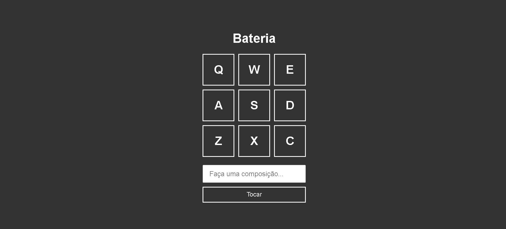

<h2 align="center"> 
  
</h2>

---
## Sobre
#### **Projeto Bateria:** Cada Botão tem um som de uma parte da bateria. Apertando os botões do teclado, você pode criar uma melodia funcionalidade
 
Na area que está escrita " Faça uma composição... " você pode digitar as letras que corresponde a um som, e assim depois aperta tocar, e vai tocar automaticamente.  
 
 ---
GitHub Pages: https://aurelianoderafa.github.io/Projeto-Bateria/

 ---
## 💻 Tecnologia utilizada
 * HTML 5 
 * CSS 3
 * JAVASCRIPT